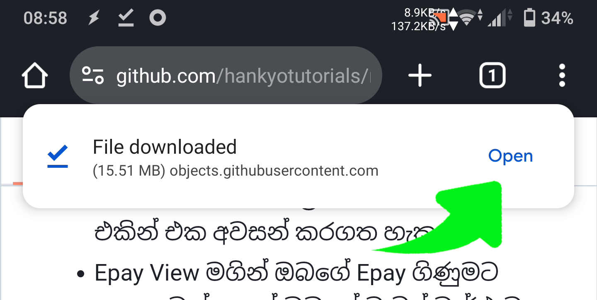

# Navyබඩී App 

මෙම Android App එක ශ්‍රී ලංකා නාවික හමුදාවේ සේවය කරන ඔබ වෙනුවෙන් නිර්මාණය කර ඇති අතර, මෙම app එක මගින්  
+ Short notes සටහන් කල හැකි අතර ඔබට අමතක වෙන, වැදගත් දේ එහි ඉක්මනින් සටහන් කරගත හැක.
+ Monthly Budget Calculator එක මගින් ඔබගේ මාසික ආදායම් හා වියදම් වල වෙනස ගණනය කල හැක.
+ Check Lists Manager එක මගින් ඔබ එදිනෙදා කරන දේවල් වල පියවරයන් වෙන් වෙන්ව List වල Save කර ඒම පියවර එකින් එක අවසන් කරගත හැක.
+ Epay View මගින් ඔබගේ Epay ගිණුමට පහසුවෙන් ගොස් ඔබගේ වැටුප් වාර්ථාව පහසුවෙන් බැලිය හැකි අතර ඔබගේ Username හා Password නිතර නිතර යෙදීමට අවශ්‍ය නැත.
+ Days Count Calculator එක මගින් ඔබ අවසන් වරට නිවාඩුගොස් පැමිණ අදට දින ගණන හා කදවුරේ රැදී සිටි දින ගණන පහසුවෙන් සෙවිය හැක.
+ Sealink View මගින් ඔබට sealink ගිණුමක් නැත්නම් පහසුවෙන් සාදාගත හැකි අතර sealink ගිණුමක් තිබේනම් sealink වෙත නිතර නිතර පහසුවෙන් යාමට හැක.
+ ඔබගේ මානසික සුවයට ඔබට කලහැකි ක්‍රියාකාරකම් සමූහයක්ද මෙහි අඩංගුය.
 

## NavyBuddy App එක ඔබගේ Android දුරකතනයට Install කරන ආකාරය:

1. පලමුව මෙම link එක මගින් මෙම මෘදුකාංගය download කරගන්න:  

      1.0V - [NavyBuddy.apk](https://github.com/hankyoTutorials/navyBuddyApp/releases/download/V1.0-Beta/NavyBuddy.apk) 
  
    
   මේම එකක් ආවොත් "Download Anyway" දෙන්න: 
   (මේ app එක open source හා කිසිම permission එකක් අවශ්‍ය නැති නිසා බයවෙන්න දෙයක් නෑ) 

    
   (Download වෙන ගමන්) 
   
2. ඉන්පසු download කරපු navyBuddy.apk file එක open කරගන්න:

   
    

3. මේ app එක playstore එකේ නැති නිසා internet එකෙන් download කරල install කරගන්න වෙන්නෙ. ඒනිසා මේකෙ "Settings" ගිහින් "Allow from this source" එක Enable කරන්න:

    
   
   
4. ඊටපස්සෙ Install කරල App එක Open කරගන්නයි තියෙන්නෙ:

    
   

## Privacy Policy:
   Navyබඩී app එක භාවිතය සදහා ඔබගේ දුරකතනයේ Strorage,Camera,Location වැනි Permission කිසිවක් අවශ්‍ය නොවන අතර, 
   මෙම app එකෙන් ඔබට ශ්‍රී ලංකා නාවික හමුදාව මගින් සපයා ඇති පොදු අන්තර්ජාල සේවා සපයන web අඩවි කිහිපයකට පිවිසිය හැකි අතර
   එම web අඩවි වලට පිවිසීමට ඔබ විසින් සපයන UserName හා Password තාවකාලිකව ඔබගේ දුරකතනයේ WebView Cache මත සුරක්ෂිතව Encript වේ. 
   මෙම app එක වෙත ඇතුලත් කරන දත්ත කිසිවක් ලබාගැනීම හෝ බෙදාහැරීම අප විසින් සිදු නොකරයි.

## License
   NavyBuddy app එක Open source license එකක් වන "GNU General Public License" යටතේ license කරඇති අතර ඔබට මෙම app එක නොමිලේ Install කර භාවිත කල හැක. 
   
   + <a href="https://github.com/hankyoTutorials/navyBuddyApp/blob/master/LICENSE.md">NavyBuddy App License</a> 
   
   තවද මෙම app එක සාදා ඇති කේතයන් ඔබට නැරඹිය හැකි අතර මෙම android app එක වෙනස් කිරීමට හා ප්‍රතිනිර්මාණය කිරීමට ඔබට අවසර තිබේ.

## ස්තූතිය පුදකිරීම:
   Navyබඩී app එක නිර්මාණය කිරීම වෙනුවෙන් පලමුවෙන්ම මාගේ අම්මා,තාත්තා හා අයියාට බෙහෙවින්ම ස්තූතියි!. 
   මෙම app එක නිර්මාණය කිරීම සදහා සහයෝගය ලබාදුන් ශ්‍රී ලංකා නාවික හමුදාවේ සේවය කරන සියලු දෙනාටද,
   අන්තර්ජාලයෙන් සහයෝගය ලබාගත් සියලුම web අඩවි හා youtube නාලිකා වලටද,
   වචනෙකින් හෝ සහයෝගය ලබාදුන් ඔබ සියලු දෙනාටද ස්තූතිය පුදකර සිටිනවා!..

   
## උපකාර

* [Github Issue](https://github.com/hankyoTutorials/linux-system-sinhala-font-changer/issues) එකක් 
open කිරීමෙන් උපකාර ලබා ගත හැකිය. 
* ඔබගේ යෝජනා,චෝදනා හා අදහස් අපට Email කරන්න: hankyomail@gmail.com
